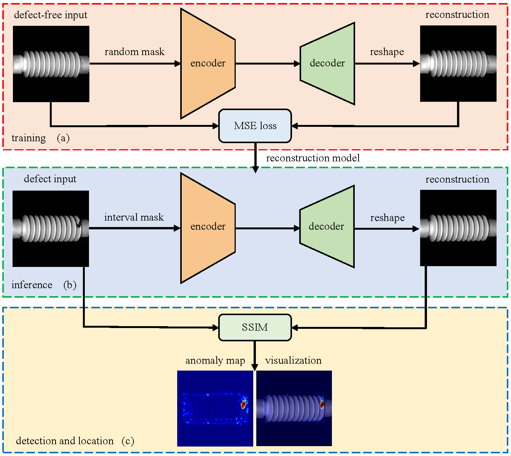
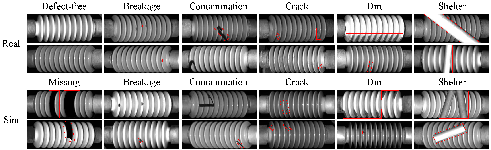
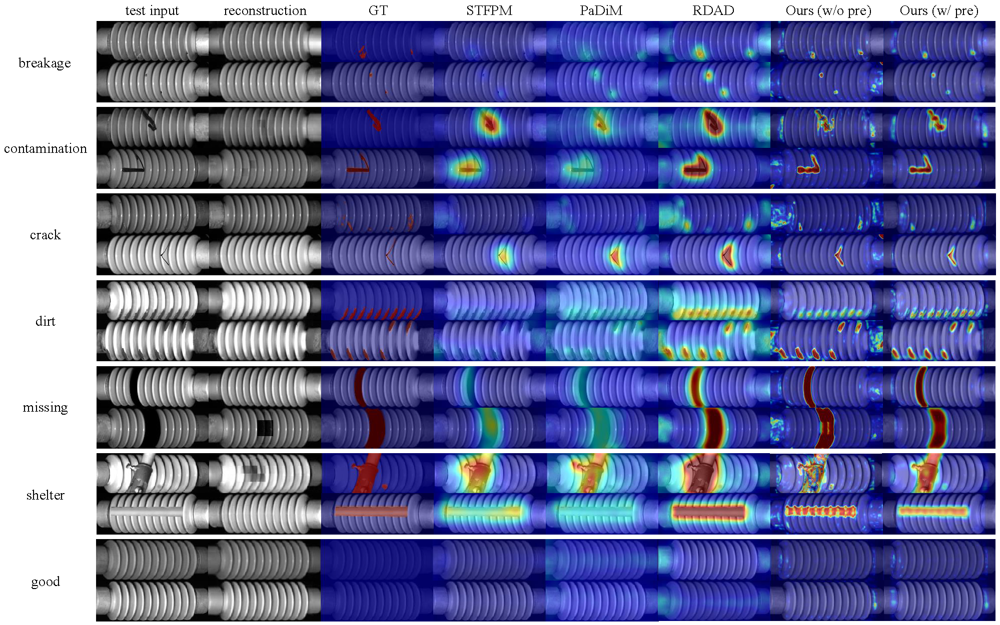

## Insulator-Defect-Detection
Official PyTorch Implementation of Catenary Insulator Defects Detection: A Dataset and an Unsupervised Baseline, Accepted by IEEE TIM.


### Datasets
Catenary Insulator Defect dataset (CID): Download from [OverDrive]()

Statistical Overview of CID
<table>
    <tr>
        <th colspan=2></th>
        <th align="center">Train</th>
        <th>Test_Real</th>
        <th>Test_Sim</th>
        <th>Test_All</th>
    </tr>
    <tr>
    <th colspan=2 >Defect-free Image</th>
        <!-- bgcolor=#ffffcc -->
        <td>3900</td>
        <td>0</td>
        <td>0</td>
        <td>33</td>
    </tr>
    <tr>
        <td rowspan=6>Defect<br>Image</td>
        <td>breakage</td>
        <td>0</td>
        <td>26</td>
        <td>34</td>
        <td>60</td>
    </tr>
        <td>contamination</td>
        <td>0</td>
        <td>5</td>
        <td>55</td>
        <td>60</td>
    </tr>
        <td>crack</td>
        <td>0</td>
        <td>2</td>
        <td>58</td>
        <td>60</td>
    </tr>
        <td>dirt</td>
        <td>0</td>
        <td>54</td>
        <td>6</td>
        <td>60</td>
    </tr>
        <td>missing</td>
        <td>0</td>
        <td>0</td>
        <td>60</td>
        <td>60</td>
    </tr>
        <td>shelter</td>
        <td>0</td>
        <td>40</td>
        <td>20</td>
        <td>60</td>
    </tr>
    <tr>
        <td colspan=2 >Total</td>
        <td>3900</td>
        <td>160</td>
        <td>233</td>
        <td>393</td>
    </tr>
</table>

Some Example of CID


The dataset should be placed in the 'datasets' folder. 
The training dataset should only contain defect-free samples, which should be named 'good'. 
The test dataset should include one category named 'good' for defect-free samples, and any other subcategories of defect samples. It should be made as follows:

```shell
Name_of_Dataset
|-- Insulator
|-----|----- ground_truth
|-----|--------|------ teat_all
|-----|--------|------ test_real
|-----|--------|------ test_sim
|-----|----- test_all
|-----|--------|------ good
|-----|--------|------ ...
|-----|--------|------ ...
|-----|----- test_real
|-----|--------|------ good
|-----|--------|------ ...
|-----|--------|------ ...
|-----|----- test_sim
|-----|--------|------ ...
|-----|--------|------ ...
|-----|----- train
|-----|--------|------ good
```

### Environment
This repository is implemented and tested on Python 3.9 and PyTorch 1.10.
To install requirements:

```setup
pip install -r requirements.txt
```

### Usage
You can download the model checkpoints directly from [Checkpoints]()

To train theMAE model, run:

```train
python main_pretrain.py
```

To evaluate and test the model, run:

```eval
python inference.py
```


### Result
Running the code as explained in this file should achieve the following results for CID:

Defect Detection (Image AUROC, P, R, F1) and Defect Localization (Pixel AUROC, P, R, F1)

<table>
    <tr>
        <th> </th>
        <th>Method</th>
        <th>AUROC</th>
        <th>P</th>
        <th>R</th>
        <th>F1</th>
    </tr>
    <tr>
        <th rowspan=3>Image-level<br>Detection</th>
        <td>w/o pre</td>
        <td>0</td>
        <td>0</td>
        <td>33</td>
        <td>33</td>
    </tr>
        <td>w/ pre</td>
        <td>0</td>
        <td>0</td>
        <td>33</td>
        <td>33</td>
    </tr>
        <td>Upper Bound</td>
        <td>0</td>
        <td>0</td>
        <td>33</td>
        <td>33</td>
    </tr>
        <tr>
        <th rowspan=3>Pixel-level<br>Localization</th>
        <td>w/o pre</td>
        <td>0</td>
        <td>0</td>
        <td>33</td>
        <td>33</td>
    </tr>
        <td>w/ pre</td>
        <td>0</td>
        <td>0</td>
        <td>33</td>
        <td>33</td>
    </tr>
        <td>Upper Bound</td>
        <td>0</td>
        <td>0</td>
        <td>33</td>
        <td>33</td>
    </tr>
</table>

### Visualization examples



### Acknowledgement

We use some codes from repositories including [MAE](https://github.com/facebookresearch/mae)

### License
This project is under the MIT license. See [LICENSE](./LICENSE) for details.